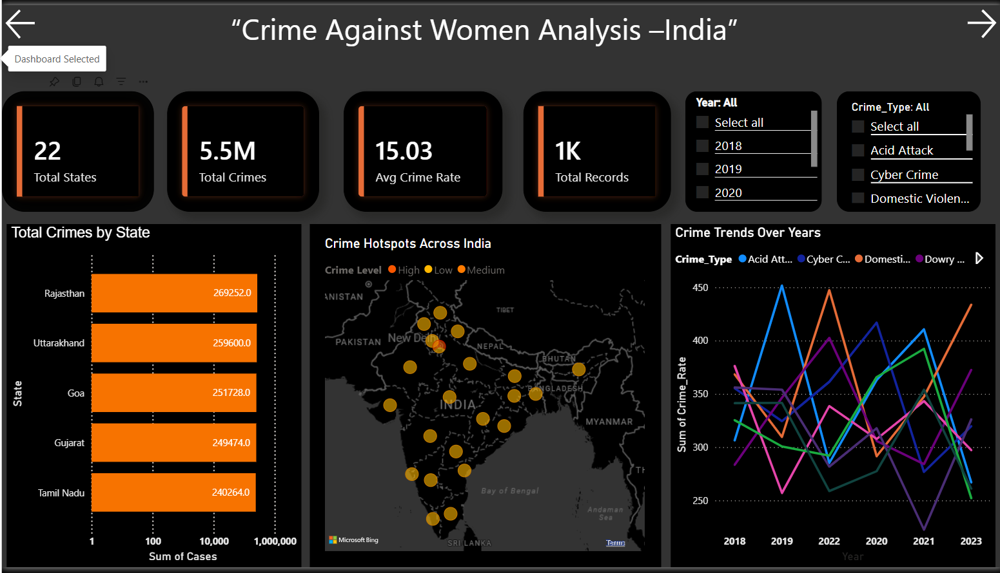

#  Crime Against Women Analysis Dashboard — India

🔗 **Live Interactive Dashboard (Click to Explore)**
https://app.powerbi.com/view?r=eyJrIjoiMjlmNGVlODMtNzU1Yi00ZTAxLTk5ZTktZTQzMTZlZDE1YWYwIiwidCI6ImUxNGU3M2ViLTUyNTEtNDM4OC04ZDY3LThmOWYyZTJkNWE0NiIsImMiOjEwfQ%3D%3D&embedImagePlaceholder=true&pageName=49ddaed3116a9055eceb

---

## 📊 Project Overview

This project focuses on analyzing **crime against women across India** using an interactive Power BI dashboard.
The goal is to uncover **patterns, trends, and risk zones** to better understand women's safety through data.

---

## 🎯 Objective

* Identify **high-risk regions**
* Analyze **crime trends over time**
* Understand the impact of different **crime categories**
* Build a **data-driven safety index**

---

## 🧠 What I Learned

* Transforming raw datasets into **meaningful insights**
* Importance of **data normalization (per population analysis)**
* Writing DAX measures for real-world analytics
* Designing **interactive dashboards (filters, bookmarks, visuals)**
* Using visualization to communicate complex data clearly

---

## 🔍 Key Insights

* High crime count does not always mean high risk (population matters)
* Crime trends vary significantly across years
* Some states consistently fall into higher risk zones
* Different crime types contribute unevenly to overall safety

---

## 📈 Features

*  Women Safety Risk Zone Map
*  State-wise Crime Analysis
*  Crime Trends Over Time
*  Crime Type Distribution
*  Risk Score (Crimes per 100,000 women)
*  Interactive filters (Year, Crime Type)

---
## 📸 Dashboard Screenshots

### 🏠 Homepage

---

### 🗺️ Women Safety Risk Zones

---

### 📊 State-wise Crime Analysis

---

### 📈 Dashboard Overview

## 🛠️ Tools & Technologies

* Power BI
* DAX (Data Analysis Expressions)
* Data Visualization

---

## 🚀 How to Use

1. Click the live dashboard link above
2. Use slicers (Year, Crime Type)
3. Interact with visuals to explore insights

---

## 💡 Key Takeaway

> Data is not just numbers — it tells a story.
> The way we analyze and visualize it can transform how we understand real-world problems.

---

##  If you found this useful

Give this repository a star ⭐
